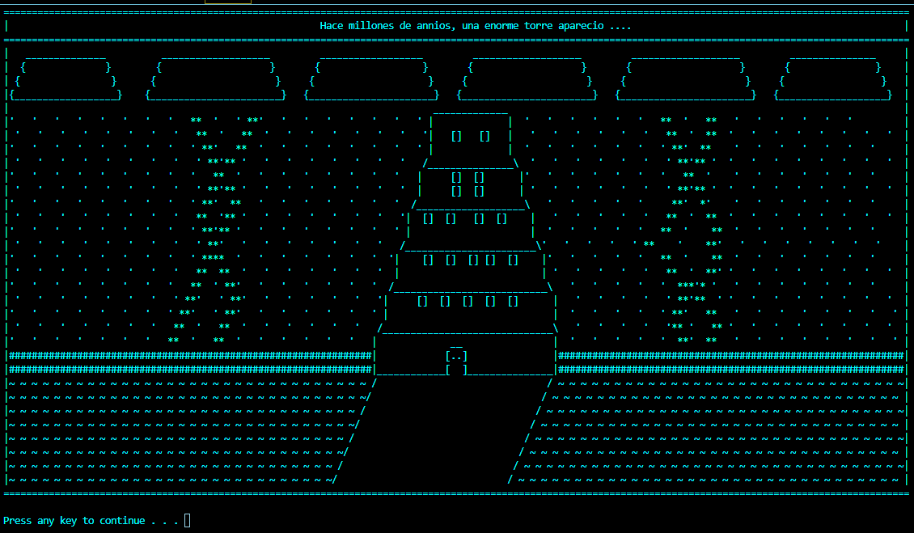

[](README.es.md)

# 🌑 Zhyniria: Shadows of the Abyss


**A Dark Text Adventure Through an Ancient Tower**

> *"Millions of years ago, an enormous tower appeared... Now, you must uncover its secrets or be consumed by the darkness within."*

---

## 🎬 Preview

<div align="center">
  
</div>

---

## 📖 Story

In the world of Zhyniria, the Tower of Dreams stands as a colossal monument that defies time and logic. Built millennia ago by a forgotten civilization, the tower was designed to contain and channel arcane energy. However, as centuries passed, the barrier between dreams and nightmares began to weaken.

Now, dark nightmares have corrupted the tower from within, transforming it into a living, ever-changing dungeon. **You are a brave soul who dares to enter**, but beware: the tower is not merely a physical place — it is a reflection of the soul and mind of those who explore it.

Will you survive the shadows? Or will you become another lost soul in the abyss?

---

## 🎮 Game Features

### 🌟 Immersive Narrative
- Gripping story with multiple twists and turns
- 4 complete chapters, each with unique challenges
- Multiple character perspectives to choose from

### 🧩 Challenging Puzzles
- Logic riddles and puzzles
- Numerical code challenges
- Word-based mysteries
- Hidden clues scattered throughout the game

### ⚔️ Survival Mechanics
- Dynamic health system
- Item management (bandages, tools)
- Decisions with real consequences
- Multiple death scenarios — be careful!

### 🎭 Character Selection
- **Renn** — A determined young woman
- **Akira** — A brave young man
- **Asuna** — A skilled warrior
- **Kirito** — A strategic thinker

### 🎨 Atmospheric Experience
- ASCII art illustrations
- Color-coded text for emphasis
- Sound effects (beeps at dramatic moments)
- Timed animations and transitions

---

## 💻 System Requirements

### 🖥️ Supported Operating Systems

| Platform | Minimum Version | Recommended Version |
|----------|----------------|---------------------|
| **Windows** | Windows 7 | Windows 10 / 11 |
| **Linux** | Kernel 3.x | Ubuntu 20.04+ / Debian 11+ |
| **macOS** | macOS 10.12 Sierra | macOS 12 Monterey+ |

---

### ⚙️ Hardware

| Component | Minimum Requirement |
|-----------|---------------------|
| **RAM** | 25 MB |
| **Storage** | 5 MB free space |
| **Processor** | Any dual-core CPU |
| **Display** | Console/Terminal (80+ columns recommended) |
| **Input** | Keyboard |
| **Network** | Not required |
| **GPU** | Not required |

---

### ⚠️ Platform Notes

> **Windows:** Windows 10 and 11 consoles natively support ANSI colors. On Windows 7 and 8, colors may not display correctly.

> **Linux / macOS:** Any modern terminal is compatible — bash, zsh, fish, and others.

---

## 📥 Download & Installation

### Step 1: Download
1. Go to the [Releases](../../releases) section
2. Download the latest `Zhyniria.exe` file
3. Save it in a folder of your choice

### Step 2: Run the Game
1. Double-click `Zhyniria.exe`
2. A console window will open
3. Enjoy your adventure!

> **Note:** Windows may show a security warning. Click "More info" → "Run anyway" to start the game.

---

## 🎯 How to Play

### Basic Controls

| Key | Action |
|-----|--------|
| **Number Keys (1-4)** | Select menu options |
| **Number Keys (0-9)** | Enter numeric codes |
| **Letters (A-Z)** | Type riddle answers |
| **Enter** | Confirm selection / Continue |
| **Backspace** | Delete last character |
| **ESC** | Exit the game |

### Gameplay Tips

✅ **Read Carefully:** Clues are hidden in the text  
✅ **Take Notes:** Write down important numbers and words  
✅ **Explore Everything:** Check all objects in each room  
✅ **Manage Your Health:** Use bandages wisely  
✅ **Save Your Answers:** Some puzzles have multiple stages  
✅ **Think Logically:** Most puzzles follow patterns  

---

## 📚 Chapter Guide

### 🕰️ Chapter 1: The Entrance Chamber
**Objective:** Solve the clock puzzle to unlock the first door  
**Difficulty:** ⭐⭐☆☆☆  
**Key Items:** Clock, Book, Chest, Painting  
**Hint:** Pay attention to the clock hands and numbers

### 🔥 Chapter 2: The Ash Room
**Objective:** Collect 5 mirror fragments while managing your health  
**Difficulty:** ⭐⭐⭐☆☆  
**Key Items:** Bandages, Shirt, Jacket  
**Hint:** Cover your face to avoid ash damage

### 📜 Chapter 3: The Diary Challenge
**Objective:** Complete the missing phrases in the diary  
**Difficulty:** ⭐⭐⭐⭐☆  
**Key Items:** Incomplete diary  
**Hint:** Look for patterns in the words

### 🗿 Chapter 4: The Five Statues
**Objective:** Solve the challenges of five mysterious sisters  
**Difficulty:** ⭐⭐⭐⭐⭐  
**Key Items:** Lantern, Rock fragments, Diary  
**Hint:** Each statue has a unique riddle or puzzle

---

## 🎲 Game Mechanics

### Health System
- **Starting Health:** 100%
- **Death:** 0% health or critical wrong decisions
- **Healing Items:** Bandages (+30% health)
- **Damage Sources:** Ashes, traps, wrong decisions

### Decision Making
- Every choice has consequences
- Some decisions lead to instant death
- Pay attention to warnings and clues
- Multiple paths to victory exist

### Puzzle Types
1. **Numeric Codes:** Enter the correct number sequence
2. **Word Riddles:** Type the answer to riddles
3. **Object Exploration:** Find hidden items in rooms
4. **Logic Puzzles:** Use clues to deduce answers
5. **Coordinate Systems:** Navigate grids to find objects

---

## ❓ FAQ

### Q: The game won't start. What should I do?
**A:** Make sure you have Windows 7 or higher. Try running it as administrator (right-click → "Run as administrator").

### Q: I can't see the colors. What's wrong?
**A:** Your console may not support colors. The game is still fully playable, just without colors.

### Q: I made a mistake. Can I go back?
**A:** No, decisions are permanent — that's part of the challenge! You can restart after a game over.

### Q: How long does it take to complete?
**A:** Approximately 20–40 minutes on a first playthrough.

### Q: Can I save my progress?
**A:** Currently there is no save system. You must complete the game in one session.

### Q: Is there more than one ending?
**A:** The game has multiple death scenarios, but one main ending if you complete all chapters.

---

## 🐛 Known Issues

- **Spanish Only:** Currently available in Spanish only
- **No Save System:** Must be completed in one session
- **Requires Console:** Needs a Windows console window
- **Fixed Window Size:** Best viewed in fullscreen console
- **No Mouse Support:** Keyboard-only controls

---

## 📸 Screenshots

```
================================================================================================
|                                    ZHYNIRIA                                                  |
|                             SHADOWS OF THE ABYSS                                             |
================================================================================================
|                                                                                              |
|                              1. -} Start the adventure                                       |
|                              2. -> Options                                                   |
|                              3. Controls / How to Play                                       |
|                              4. X Exit                                                       |
|                                                                                              |
================================================================================================
```

---

## 💀 Death Scenarios

Watch out! The game features multiple ways to die:

1. **Ash Suffocation** — Fail to protect yourself from the ashes
2. **Wrong Puzzle Answer** — Too many failed attempts
3. **Trap Activation** — Choose the wrong objects
4. **Crushing Death** — Trigger lethal mechanisms
5. **Anxiety Overload** — Take too long to decide
6. **And more...** — Discover them yourself!

---

## 📞 Support & Contact

Having trouble? Need help with a puzzle?

📧 **Email:** cgmagallanes23@gmail.com  
🐛 **Report Bugs:** [Open an Issue](../../issues)  
💬 **Discussions:** [Community Forum](../../discussions)

**Please include:**
- Your Windows version
- Description of the problem
- Screenshot (if possible)
- What you were trying to do

---

## 👥 Credits

### Development Team: ModeX

- **Carlos Gabriel Magallanes López** — Lead Developer
- **Kevin Zaid Barron Pando** — Developer
- **Marco Andrés Bonilla Murillo** — Developer
- **Sergio Badiola Muñoz** — Game Designer
- **Jose Abraham Adame Gallardo** — Game Designer

**Development Period:** April 29 – June 12, 2025

---

## 📜 License

This game is free for personal use.  
© 2025 ModeX Development Team

**Please do NOT:**
- Redistribute modified versions
- Use for commercial purposes
- Remove the credits

**You are welcome to:**
- Share the original download link
- Stream or record gameplay
- Create guides and tutorials

---

## 🌟 Final Words

*"The tower awaits you, brave adventurer. Will you uncover its secrets, or will the darkness claim another soul? The choice is yours... if you dare to enter."*

**Good luck, and may the light guide you through the shadows!**

---

⚔️ **Download now and begin your journey into the abyss!**

[📥 Download Zhyniria.exe](../../releases/latest)

---

*Last Updated: December 16, 2025*  
*Version: 1.0 — Complete Edition*
